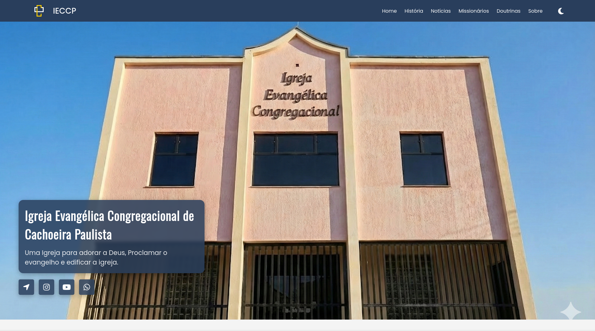
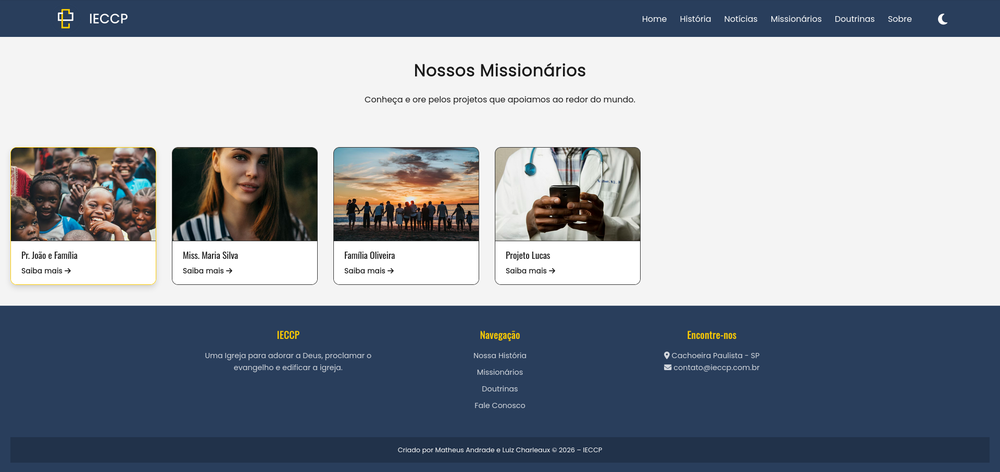

# ⛪ Website Institucional - IECCP

> Portal institucional moderno, responsivo e com carregamento dinâmico, desenvolvido com foco na experiência do usuário.

## 📖 Sobre o Projeto

Este projeto consiste no desenvolvimento do front-end do novo portal da Igreja Evangélica (IECCP). O objetivo principal foi criar uma interface **totalmente responsiva**, limpa e acessível.

O grande diferencial técnico é a arquitetura de **carregamento dinâmico**: embora seja um site estático no servidor, ele utiliza **JavaScript moderno** para consumir arquivos JSON ("banco de dados estático"). Isso permite que o conteúdo (notícias, missionários) seja separado do código, facilitando a manutenção e garantindo performance instantânea.

## 🛠 Tecnologias Utilizadas

O projeto foi construído utilizando as bases fundamentais da web, sem dependência de frameworks pesados, garantindo leveza e controle total do código.

- ** Estrutura Semântica:** Uso de tags modernas (`<template>`, `<header>`, `<footer>`) para melhor SEO e acessibilidade.
- ** Estilização Avançada:**
  - CSS Variables (Temas Claro/Escuro).
  - Flexbox & Grid Layout para responsividade.
  - Animações CSS puras (Menu Hambúrguer, Cards).
- ** Interatividade:**
  - **Fetch API:** Consumo assíncrono de dados (JSON).
  - **DOM Manipulation:** Renderização de cards em tempo real.
  - **Lógica de UI:** Controle de temas e menu mobile.

## ✨ Funcionalidades de Design

- **📱 Responsividade Total:** Layout fluido que se adapta de celulares a monitores ultrawide.
- **🌙 Dark Mode Persistente:** O site detecta e lembra a preferência de tema do usuário.
- **⚡ Carregamento Otimizado:** Imagens e conteúdos carregados sob demanda via JSON.
- **🎨 UI/UX:** Feedback visual em botões, transições suaves e tipografia hierárquica (Oswald & Poppins).

## 📸 Screenshots

| Home |
|:---:
|  |

| Missionários |
|:---:
|  |

## 🗺 Roadmap de Desenvolvimento

O foco atual foi a entrega da interface (Frontend). Os próximos passos envolvem a criação do ecossistema de gerenciamento.

- [x] **Fase 1: Frontend (Concluído)**
  - Estruturação HTML/CSS.
  - Lógica JS para consumo de JSON.
  - Design Responsivo e Dark Mode.
- [ ] **Fase 2: Backend & Sistema (Próximos Passos)**
  - Criação de Painel Administrativo (Dashboard).
  - Implementação de sistema de Login seguro.
  - CRUD (Criar, Ler, Atualizar, Deletar) para Notícias e Missionários.
- [ ] **Fase 3: Infraestrutura**
  - Migração de JSON para Banco de Dados SQL.
  - Deploy em servidor de produção.

Criado com ❤️ por [Luiz Francisco](https://github.com/luizkikinho) e [Matheus Andrade](https://github.com/MatheusMX900)
